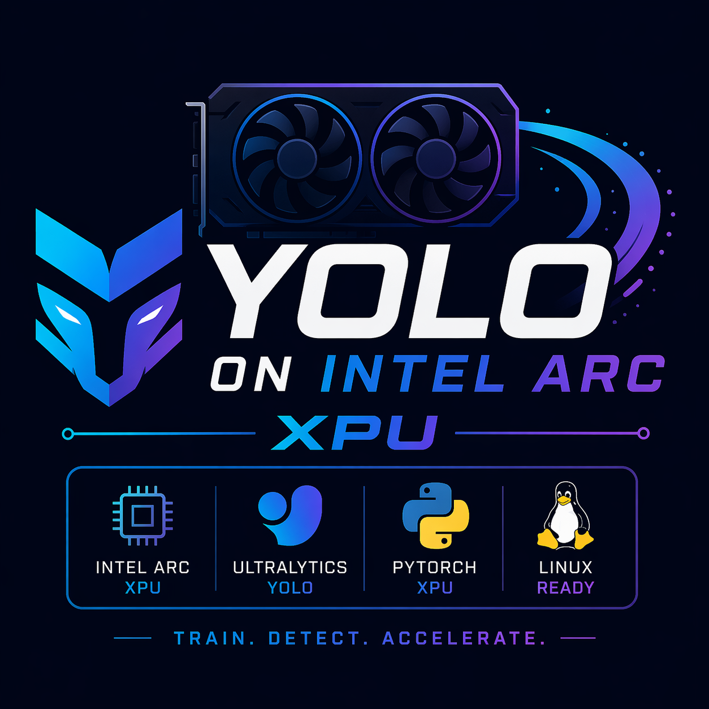
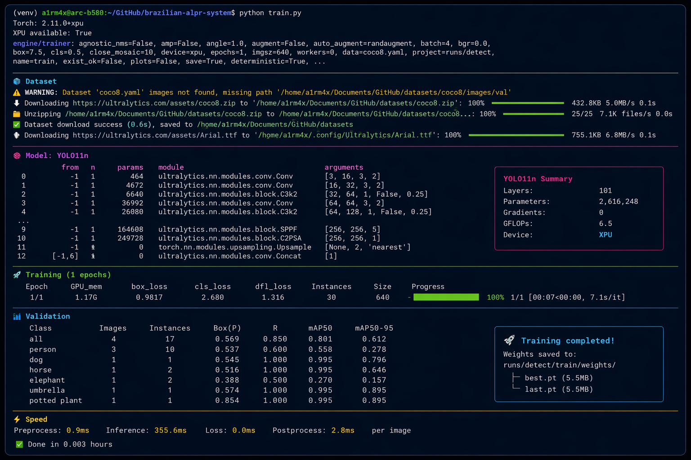

<!-- Canonical repository: https://github.com/sidnei-almeida/ultralytics-intel-arc-xpu -->
<p align="center">
  
</p>

<h1 align="center">ultralytics-intel-arc-xpu</h1>

<p align="center">
  <strong>Production-ready tooling to train and run Ultralytics YOLO on Intel® Arc™ GPUs via PyTorch XPU.</strong>
</p>

<p align="center">
  <a href="LICENSE"></a>
  <a href="https://www.python.org/downloads/"></a>
  
  
</p>

<p align="center">
  <a href="#overview">Overview</a> ·
  <a href="#gallery">Gallery</a> ·
  <a href="#features">Features</a> ·
  <a href="#requirements">Requirements</a> ·
  <a href="#installation--quick-start">Quick start</a> ·
  <a href="#cli-reference">CLI</a> ·
  <a href="#training--examples">Examples</a> ·
  <a href="#what-the-patch-changes">Patch details</a> ·
  <a href="#troubleshooting">Troubleshooting</a> ·
  <a href="#author">Author</a> ·
  <a href="#license">License</a>
</p>

---

## Overview

**ultralytics-intel-arc-xpu** closes the integration gap between upstream [Ultralytics](https://github.com/ultralytics/ultralytics) and Intel’s **PyTorch XPU** runtime. Ultralytics ships first-class support for CUDA and Apple Metal (MPS); Intel Arc accelerators expose a distinct device namespace (`xpu`). Rather than maintaining a long-lived fork, this project applies a **minimal, reviewable patch** to the `ultralytics` package already installed in your virtual environment, enabling:

| Capability | Outcome |
|------------|---------|
| **Device parity** | Use `torch.device("xpu")` in `train`, `val`, and `predict` flows. |
| **Operational safety** | One-time `.bak` snapshots; deterministic restore to vendor files. |
| **Operator ergonomics** | A **Rich**-based CLI for patch / restore / diagnostics, plus scriptable subcommands for automation. |

The patch targets three modules only (`torch_utils`, `trainer`, `validator`); everything else remains untouched, so you stay aligned with upstream releases and upgrade paths.

---

## Gallery

### Jupyter — XPU in use

The screenshot below shows a real workflow: PyTorch reporting XPU availability, device selection, and a YOLO training cell executing on the Intel Arc accelerator inside Jupyter.

<p align="center">
  
</p>

<p align="center">
  <em><strong>Figure 1.</strong> End-to-end validation in Jupyter: XPU detected, model moved to <code>xpu</code>, training loop running on Intel Arc.</em>
</p>

---

## Features

| Area | Description |
|------|-------------|
| **Interactive CLI** | Menu-driven flow: patch, restore, doctor, examples—built with [Rich](https://github.com/Textualize/rich) for readable status and progress. |
| **Automation-friendly** | Same operations via subcommands (`patch`, `restore`, `doctor`) for CI and shell scripts. |
| **Safe defaults** | Original files copied to `<name>.bak` before any edit; restore is a straight copy back from backup. |
| **Idempotent patching** | Re-running the patch skips already-applied snippets instead of corrupting files. |
| **Diagnostics** | “Doctor” summarizes Python, venv, PyTorch, XPU visibility, Ultralytics path, and per-file patch state. |
| **Examples** | Ready-to-run scripts for smoke training, custom datasets, prediction, and micro-benchmarks under `examples/`. |

---

## Requirements

| Component | Notes |
|-----------|--------|
| **OS** | Linux (Intel Arc + compute stack as per Intel documentation). |
| **Python** | 3.9 or newer, inside an **activated virtual environment**. |
| **PyTorch** | A build with **Intel XPU** support (`torch.xpu.is_available()` should be `True` when drivers/runtime are correct). |
| **Ultralytics** | Installed in the **same** environment you patch (e.g. `pip install ultralytics`). |
| **CLI dependency** | `rich` (pinned in `requirements.txt`). |

> **Note:** Installing PyTorch with XPU and the oneAPI / Level Zero stack is distribution-specific. This repository does not ship wheels; follow Intel’s official guidance for your kernel and driver set, then install Ultralytics and run this patcher.

---

## Installation & quick start

```bash
# 1. Activate your project virtual environment
source venv/bin/activate

# 2. Install the CLI UI dependency
pip install -r requirements.txt

# 3. Launch the interactive menu
./ultralytics-xpu
```

You should see the branded banner, an environment summary, and a numbered menu (patch, restore, doctor, examples, quit).

---

## CLI reference

### Interactive (default)

```bash
./ultralytics-xpu
# or
python -m ultralytics_xpu
```

### Non-interactive

```bash
./ultralytics-xpu patch                    # Apply the XPU patch (creates .bak if missing)
./ultralytics-xpu restore                  # Restore from .bak (keeps backups)
./ultralytics-xpu restore --delete-backups # Restore and remove .bak files
./ultralytics-xpu doctor                   # Print environment + target file status
```

Shortcuts:

```bash
./scripts/patch.sh
./scripts/restore.sh
```

### Optional: install as a package

With `pip install .` from the repo root, the entry point `ultralytics-xpu` is registered via `pyproject.toml`.

---

## Training & examples

Minimal training snippet (matches the smoke test philosophy: small dataset, explicit device, AMP off until stable):

```python
from ultralytics import YOLO
import torch

model = YOLO("yolo11n.pt")

model.train(
    data="coco8.yaml",
    epochs=1,
    imgsz=640,
    batch=4,
    device=torch.device("xpu"),
    amp=False,
    plots=False,
    workers=0,
)
```

| Script | Purpose |
|--------|---------|
| [`examples/train_yolo11n_xpu.py`](examples/train_yolo11n_xpu.py) | Quick `coco8` smoke test |
| [`examples/train_custom_xpu.py`](examples/train_custom_xpu.py) | Template for your own `data.yaml` |
| [`examples/predict_xpu.py`](examples/predict_xpu.py) | Inference on images, folders, or URLs |
| [`examples/benchmark_xpu.py`](examples/benchmark_xpu.py) | Simple throughput / latency check |

---

## What the patch changes

Only **three** files inside your site-packages `ultralytics/` tree are modified:

| File | Purpose |
|------|---------|
| `utils/torch_utils.py` | Recognizes `xpu` / `xpu:0` in `select_device`, logs `XPU`, seeds `torch.xpu` RNGs when available. |
| `engine/trainer.py` | Treats `xpu` like other supported devices; routes `autocast` and CUDA-style memory helpers to `torch.xpu` when `device.type == "xpu"`. |
| `engine/validator.py` | Allows validation on `xpu` alongside `cpu` / `mps`. |

Each file is backed up as `<filename>.bak` **before** the first modification. Restore overwrites the working file from that backup for a byte-level return to the pre-patch state.

---

## Project layout

```
.
├── ultralytics-xpu          # Bash launcher (venv-aware, optional rich bootstrap)
├── ultralytics_xpu/         # Python package: CLI, UI, patcher, restorer, env probes
├── scripts/                 # Thin wrappers for patch / restore
├── examples/                # Training, predict, benchmark scripts
├── images/
│   ├── logo.png             # Branding / README hero
│   └── example.png          # Jupyter screenshot (XPU verified)
├── pyproject.toml
├── requirements.txt
└── README.md
```

---

## Troubleshooting

| Symptom | What to check |
|---------|----------------|
| `torch.xpu.is_available()` is `False` | Driver / runtime / PyTorch XPU build—not a problem this repo can fix in software alone. Confirm Intel’s install steps. |
| “No virtual environment active” | Run `source venv/bin/activate` (or your env manager’s equivalent) before `./ultralytics-xpu`. |
| Patch warns “snippet not found” | Your Ultralytics version may differ from the lines the patch anchors on. Note `pip show ultralytics` and open an issue with the version string. |
| Training errors after patch | Restart the Python process / Jupyter kernel so the patched modules are reloaded. |

---

## Author

| | |
| --- | --- |
| **Maintainer** | [Sidnei Almeida](https://github.com/sidnei-almeida) ([@sidnei-almeida](https://github.com/sidnei-almeida)) |
| **Repository** | [github.com/sidnei-almeida/ultralytics-intel-arc-xpu](https://github.com/sidnei-almeida/ultralytics-intel-arc-xpu) |
| **LinkedIn** | [linkedin.com/in/saaelmeida93](https://www.linkedin.com/in/saaelmeida93/) |

---

## Contributing

Issues and pull requests are welcome—especially reports that include **Ultralytics version**, **PyTorch version**, and a short **doctor** output.

---

## License

This project is released under the [MIT License](LICENSE).

---

<p align="center">
  <sub>Intel® and Arc™ are trademarks of Intel Corporation. This project is not affiliated with or endorsed by Intel Corporation or Ultralytics.</sub>
</p>
